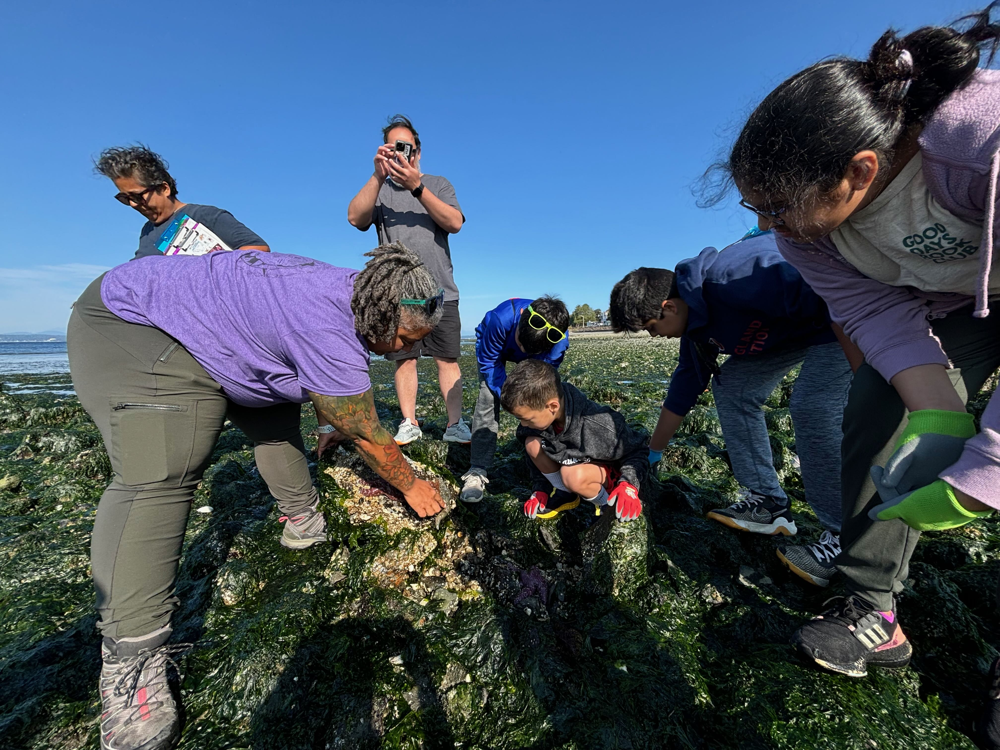

```{r setup, include=FALSE}
knitr::opts_chunk$set(echo = FALSE)

```

## {.flexbox .vcenter .bigger}
<font size="12">
Welcome!
</font>

## {.flexbox .vcenter .bigger}
<font size="10">
About Me
</font>

## Husky at Heart

##  {data-background=images/marbio.jpeg data-background-size=30%}

## PhD loading...

<div style="text-align: center; margin-bottom: 1em;">
  
</div>

<div style="display: flex; justify-content: center; gap: 2em;">
  
  
  
</div>

<div style="font-size: 70%; text-align: center; margin-top: 1em; color: #85754d;">
  Interrogating Conservation in Puget Sound via Community- engaged Science
</div>


## Educator & Joy- Dealer

<div style="text-align: center;">
  
  
  
</div>

<div style="font-size: 70%; text-align: center; margin-top: 1em; color: #85754d;">
You've gotta find joy before you can do the hard work
</div>

## {.flexbox .vcenter .bigger}
<font size="10">
About You
</font>

## {data-background=images/boxer.jpeg data-background-size=50% .futnote}

If you could pick up a walk-up song, what would it be?
<div class="notes">
Please share your name, how you're feeling & a walk-up song
</div>

## {.flexbox .vcenter .bigger}
<font size="12">
What is a Diversity Statement?
</font>

- Also known as a Perspectives or Experience Statement
- One of three statements in an application package
- Least clear and most misunderstood piece of the package

## {.flexbox .vcenter}
Timeline | Inception of the Diversity Statement

- Early 2000s in the UC system
- Early 2010s Widely adopted by universities for faculty positions
- Mid 2010s Called into question by creating the false dichotomy of DEI v Merit- based hiring
- 2018 UC system made the statements mandatory for tenure-track position applications

## {.flexbox .vcenter}
Timeline | Current State of the Statement

- 2020 Near complete adoption of the practice **allegedly** in response to the murder of George Floyd
- 2022 UW rejected making the statement a requirement for tenure-track applications
- 2023 Banned in public institutions in Texas, North Carolina and Missouri
- 2025 it is often a requirement in non-tenure track applications, often optional

## {.flexbox .vcenter}
Purpose

- Academic search committees can gauge a candidate's 'fit' with the institution/ student body
- Documentation method to include the unpaid labor and often overlooked work of non-majority candidates

## {.flexbox .vcenter .bigger}
<font size="12">
So, *what* is it actually?
</font>

## {.flexbox .vcenter}
It is

- Fundamental demonstration of your values, commitments and capabilities in an academic position
- Three areas of demonstration - the core of the academic position
  - Research
  - Teaching
  - Service
- Another opportunity to stand out

## {.flexbox .vcenter .bigger}
<font size="12">
What it is *not*
</font>

## {.flexbox .vcenter}
It is not

- About you 
  - Your identities 
  - Your privileges 
- Not a chance to medal in the Oppression Olympics
- Not a savior narrative, nor a
  - Pie in the Sky
  - We are the World
  - Ideological pontification

## {.flexbox .vcenter}
How does it fit in your application package?

- Teaching Statement highlights your
  - Philosophy in practice
  - Qualifications
  - Future contributions 
- Research Statement highlights your
  - Direction and purpose of scientific inquiry
  - Funding capabilities
  - Collaborative potential and broader field contributions


## {data-background=images/dancer.jpeg data-background-size=70% .futnote}
Bow on the package 

## {.flexbox .vcenter .bigger}
<font size="12">
Why write one?
</font>

## {.flexbox .vcenter}
Why?

- Demonstrate your alignment with the institution's mission, vision & values (MVV)
- Opportunity to expand on what you’ve written in your teaching & research statements
- Showcases your understanding of ‘DEI’ beyond visible diversity
- Thematically present yourself as the complete package by weaving your narrative across all 3 statements

## {.flexbox .vcenter .bigger}
<font size="12">
How to Write a Diversity Statement
</font>

## {.flexbox .vcenter}
Preparation | Things You'll Need

1) Institution's MVV
2) Writing Tool/ Laptop
3) Your CV

## {.flexbox .vcenter .bigger}
<font size="12">
Process <br> Step 1 of 5: Institution's MVV
</font>

1) What resonates?
2) What's itchy?
3) What feels genuine?
4) What's aspirational?

## {.flexbox .vcenter .bigger}
<font size="12">
Process <br> Step 2 of 5: Reflection
</font>

1) Identity/ Privilege Wheel inventory
2) Values + Teaching Philosophy Alignment
3) Knowledge of current research in pedagogy/ research/ student engagement

## {.flexbox .vcenter .bigger}
<font size="12">
Process <br> Step 3 of 5: Run the Stats
</font>

1) List SPECIFIC activities you’ve created/ participated in
2) List SPECIFIC organizations you’ve created/ participated in
3) List SPECIFIC teaching tactics/ strategies you’ve employed 
4) List SPECIFIC research process accommodations/ protocols/ etc. that you’ve created

## {.flexbox .vcenter .bigger}
<font size="12">
Process <br> Step 4 of 5: Synthesis
</font>

1) What is sticking out to you?
2) Are you balanced across the 3 areas (research, teaching, service)
3) How are you feeling? 

## {.flexbox .vcenter .bigger}
<font size="12">
Process <br> Step 5 of 5: Drafting the Statement
</font>

- Framing here is key 
- Reinforce how you and your work align with the institution’s MVV
- Hook your reader - personal anecdote
- Tell a cohesive story with specific examples

## {.flexbox .vcenter .bigger}
<font size="12">
Things to Keep in Mind
</font>

## {.flexbox .vcenter}
Pitfalls to Avoid

- Over-sharing your personal story
- Over-sanitizing your statement is a red flag 
- Self depreciation due to your privilege *or* 
- Trauma dumping to prove you've 'earned it'

## {.flexbox .vcenter}
Pitfalls to Avoid

- False equivalencies - hyperbole and rhetoric are not useful tools here
- Lack of specificity - theory is just an unpracticed thought in this regard
- Trying to make a dollar out of 15 cents - don't oversell or inflate your experiences

## {.flexbox .vcenter}
Tips for Writing & Editing

- Remember: “Diversity statements are fundamentally about your values, commitments, and capabilities, and the ways it shapes your work.”
- Limited experience does not make you a terrible educator, just a new one.
  - Demonstrate what you’ve learned and how you can implement it. 
  - Don't let your beliefs around the *facts* to supersede the facts themselves
- Writing a positionality statement first 

## {.flexbox .vcenter} 
Tips for Writing & Editing

- Storyboarding or concept mapping your package makes this easier to visualize
- Updating your CV before beginning
- Tailor it to the institution and position
- Don't waste space repeating yourself
- Get another set of eyes on that joint! 

## {.flexbox .vcenter}
<font size="12">
Wrapping it up
</font>

## {.flexbox .vcenter}
Reminders

- Remember, it is not who you are, but what you can do
- Specificity, specificity, specificity!
- Connect this statement to your teaching and research statements for maximum impact

## {.flexbox .vcenter}
Resources

<div style="display: flex; justify-content: space-between; align-items: center;">
  
  
</div>

<div style="font-size: 90%; text-align: center; margin-top: 1em; color: #85754d;">
  All content: github.com/ChrisMantegna/diversity_statements
</div>


