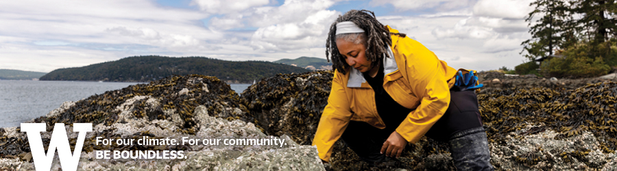
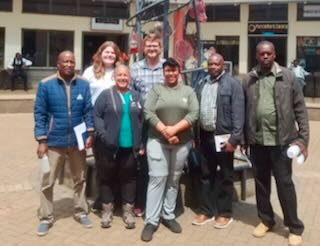

```{r setup, include=FALSE}
knitr::opts_chunk$set(echo = TRUE, warning = FALSE,
                      fig.align = "center", out.width = '90%')
```

<br>

# Welcome

```{r, echo = FALSE, fig.align = "left", out.width = "50%"}

```

>Chris Mantegna, University of Washington  
>PhD Student, Roberts Lab  
>Marine Molecular Ecology  
>Primary Focus is contamination's impact on the gene expression of foundational nearshore organisms. 

<br>

## Plan for today

1.  eDNA Basics

2.  Experimental Design: Preparation & Sampling

3.  Sample Processing & Analysis

<br>


### Thank You!
```{r, echo = FALSE, fig.align = "left", out.width = "40%"}
knitr::include_graphics("images/convergence_lab.png")
```

>Dr. Kassandra Ford and the University of Minnesota

```{r, echo = FALSE, fig.align = "left", out.width = "40%"}

```

>The Ichythyology Team at the National Museum of Kenya

```{r, echo = FALSE, fig.align = "left", out.width = "40%"}

```

>University of Washington & The Roberts Lab


<br>

# Background

## Introduction

Environmental DNA (eDNA) is changing biodiversity monitoring and ecological research. In this session, we explore what eDNA is, how it works, and its expanding role in conservation, research, and museum science.

------------------------------------------------------------------------

## What is eDNA?

Environmental DNA (eDNA) refers to genetic material obtained directly from environmental samples — such as water, soil, air, or snow — without the need to isolate target organisms.

eDNA includes: - Shed skin, mucus, feces - Decomposed tissue - Gametes - Extracellular fragments floating in the environment

```{r, echo = FALSE, fig.align = "left", out.width = "50%"}
knitr::include_graphics("images/edna_sources.jpg")
```

------------------------------------------------------------------------

## A Brief History of eDNA

### Early Foundations (Pre-2008)

-   Ancient DNA work from sediments and permafrost (e.g., Willerslev, Pääbo).
-   Soil microbial ecology laid the foundation for extracting DNA from complex environments.

### Pioneering Detection (2008–2012)

-   *Ficetola et al. (2008)*: Detected bullfrog DNA from pond water.
-   Established proof-of-concept: presence without physical capture.

### High-Throughput Era (2012–2016)

-   Introduction of metabarcoding and next-gen sequencing.
-   Shift from single-species qPCR to community-level assessments.
-   Use of genetic markers like COI, 16S, 18S.

### Widening the Lens (2016–2020)

-   Applications expanded beyond water: air, soil, snow, even spider webs.
-   eDNA began to inform policy (e.g., endangered species detection).
-   Museums began exploring ethanol and substrate eDNA.

### Current Trends (2020–Present)

-   Portable sequencing (e.g., Nanopore) for field applications.
-   Use in restoration, climate resilience, and community science.
-   Challenges include interpretation, persistence, and contamination control.

------------------------------------------------------------------------

## Why Use eDNA?

-   **Non-invasive**: No need to catch or disturb organisms.
-   **Broad spectrum**: Can detect many taxa from a single sample.
-   **Cost-effective**: Reduces field time, increases resolution.
-   **Powerful in challenging environments**: Deep sea, wetlands, sediment cores.

------------------------------------------------------------------------

# Applications of eDNA

### Ecology & Conservation

-   Community biodiversity surveys
-   Invasive species detection
-   Rare/endangered species monitoring

### Museum and Archive Contexts

-   Sequencing some preserved specimens
-   Substrate sampling (e.g., drawer dust, case sediment)
-   Linking DNA to voucher specimens

### Other Fields

-   Pathogen surveillance (e.g., wastewater SARS-CoV-2 detection)
-   Airborne eDNA for terrestrial surveys
-   Sediment cores for historical biodiversity analysis

------------------------------------------------------------------------

# Core Concepts

### Metabarcoding vs. Barcoding

-   **Barcoding**: One species, one marker
-   **Metabarcoding**: Amplify a genetic region across all species in a sample

### Key Marker Genes

-   **COI** – animals
-   **16S** – bacteria & archaea
-   **18S** – eukaryotes
-   **ITS** – fungi

### ASVs vs. OTUs

-   **ASVs (Amplicon Sequence Variants)**: Exact sequence identification
-   **OTUs (Operational Taxonomic Units)**: Clustered sequences by similarity

------------------------------------------------------------------------

# Limitations and Considerations

-   eDNA doesn't always indicate **live presence**
-   Degradation and transport can **influence spatial accuracy**
-   False positives and false negatives are a concern
-   Contamination control is **crucial**

------------------------------------------------------------------------

# Further Reading

-   Ficetola et al. 2008 – Amphibian detection via eDNA
-   Deiner et al. 2017 – Overview of aquatic eDNA
-   Taberlet et al. 2012 – Origins and potentials of eDNA
-   Yoccoz 2012 – Emerging roles in biodiversity monitoring

------------------------------------------------------------------------

## Appendix: Terminology Glossary

| Term | Definition |
|----|----|
| **eDNA** | DNA from the environment (water, soil, air) |
| **Metabarcoding** | Amplifying DNA from multiple taxa at once |
| **ASV** | Exact sequence from reads; higher resolution than OTU |
| **OTU** | Cluster of similar sequences, usually 97% identity |
| **Marker gene** | Gene used for identification (COI, 16S, 18S, ITS) |
| **PCR** | Technique to amplify DNA |
| **Primers** | Short DNA sequences that initiate PCR |
| **Taxonomy assignment** | Matching sequences to known organisms |
| **Field blank** | Control sample for detecting contamination |
| **Library prep** | Preparing DNA for sequencing |
| **Reference database** | Known sequences used to match taxa |
| **Rarefaction** | Normalizing sequencing depth for comparison |
