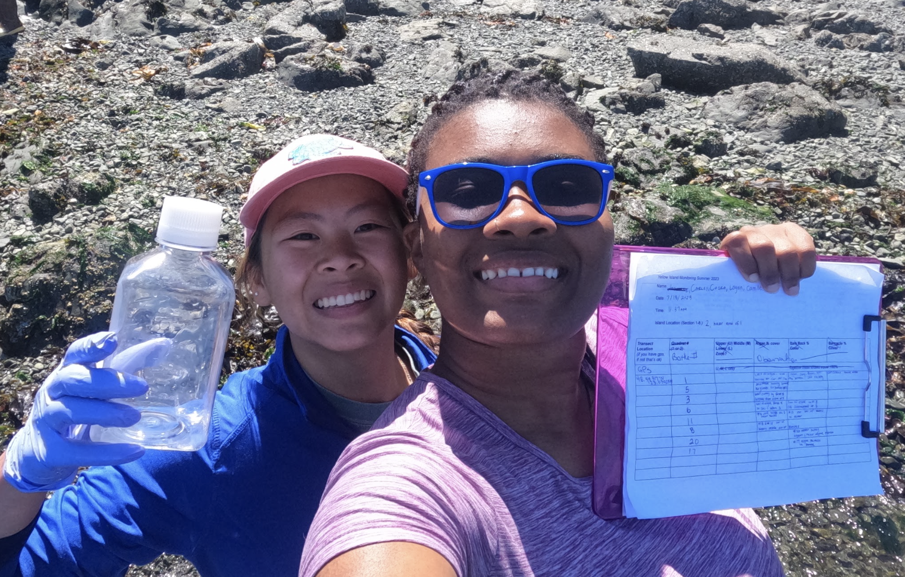

# Introduction

Before collecting a single sample, it’s important to think through the full design of your eDNA project. This section introduces the considerations and protocols for preparing and collecting high-quality eDNA samples in both field and museum environments.

---

# Designing an eDNA Study

## What’s the research question?
- Are you detecting a specific species or surveying communities?
- Temporal and spatial scales matter.

## Choosing the right marker
- Based on your taxa of interest (e.g., COI for animals, 18S for eukaryotes).
- Consider ecosystem and sample type (water vs. sediment vs. swabs).

## Consider DNA persistence
- Environmental DNA degrades over time.
- Degradation influenced by UV light, temperature, pH, microbial activity.

---

# Sampling Environments

## Aquatic Sampling
- Surface water, mid-column, sediment cores.
- Marine and freshwater protocols differ in filtration volume and salinity handling.

```{r, echo = FALSE, fig.align = "left", out.width = "50%"}

```

## Terrestrial and Air Sampling
- Soil or snow sampling using sterile scoops or syringes.
- Air filters or cyclone samplers for airborne DNA.

## Museum Settings
- Swabbing collection surfaces, containers, or tools.
- Extracting DNA from ethanol or residual fluids.

---

# Filtration and Preservation

## Filter Types
- Sterivex (enclosed, on-site filtration)
- Glass fiber or cellulose nitrate filters (lab filtration)

```{r, echo = FALSE, fig.align = "left", out.width = "50%"}
knitr::include_graphics("images/edna.jpg")
```

## Volume Considerations
- 250 mL to 2 L common for water samples
- Use peristaltic pumps or syringes with luer-lock filter holders

## Preservation Options
- Ethanol or Longmire’s buffer
- Dry preservation (silica desiccant)
- Freeze at -20°C or lower ASAP

---

# Contamination Control

## Field Protocols
- Wear gloves and change them between samples
- Sterilize gear with 10% bleach + rinse
- Use single-use consumables when possible

## Controls
- Field blanks (filtered water from the field site)
- Filtration blanks (no sample passed through filter)
- Lab blanks (control throughout extraction process)

---

# Metadata Collection

## Essential Fields
- GPS coordinates
- Date and time
- Water temperature, salinity, turbidity, pH
- Weather and tides (for marine)

## Museum Context
- Specimen ID and accession numbers
- Container type, date of preservation
- Preservation fluid composition

---

# Field Kits and Logistics

- Pre-label tubes and filters
- Bring extra gloves, sample tubes, waste containers
- Clean workspace for filtering (e.g., in the car, pop-up lab tent)

---

# Preservation Challenges in Museum Samples

## Ethanol Preservation
- Ethanol can preserve DNA fairly well, especially at high concentrations (95–100%).
- However, over time, ethanol can **cause hydrolysis**, leading to DNA fragmentation.
- Repeated ethanol changes or evaporative concentration can alter preservation effectiveness.
- DNA yield is typically lower in aged ethanol than fresh environmental samples.

## Formalin Fixation
- Formalin **crosslinks proteins and nucleic acids**, severely degrading or blocking PCR amplification.
- DNA in formalin-fixed samples is often:
  - Highly fragmented
  - Chemically modified (e.g., methylol adducts)
  - Difficult to extract without specialized protocols (e.g., reversal treatments or harsh lysis)

## Considerations for Museum Researchers
- Prioritize ethanol-preserved materials when possible
- Use extraction protocols designed for **low-yield or fragmented DNA**
- Document preservative type and history in metadata

---

# Foundational Reading

- **Hofreiter et al. (2001)** – Ancient DNA from museum specimens  
  _Nature Reviews Genetics, 2(5), 353–359._  
  https://doi.org/10.1038/35072071

- **Zimmermann et al. (2008)** – DNA damage in preserved tissue  
  _Biotechniques, 44(5), 619–626._  
  https://doi.org/10.2144/000112812

- **Raxworthy & Smith (2021)** – Museum genomics: New uses for old collections  
  _Trends in Ecology & Evolution, 36(8), 707–718._  
  https://doi.org/10.1016/j.tree.2021.04.007

- **Díez-del-Molino et al. (2018)** – High-throughput sequencing of museum specimens  
  _Trends in Ecology & Evolution, 33(7), 633–648._  
  https://doi.org/10.1016/j.tree.2018.05.005

---
# Summary

Good eDNA starts with good planning. Clear protocols, contamination controls, and rich metadata ensure high-quality results and reproducibility.

